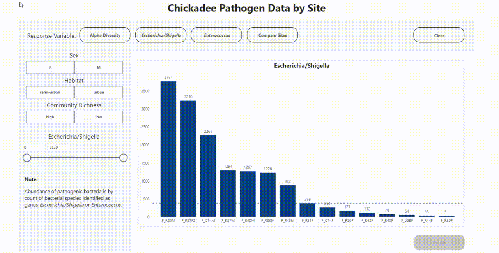

# Chickadee Data Analysis

Various statistical analyses were performed on data from mountain chickadee sites to examine microbial community compositions associated with chickadees in urban, semi-urban, and rural environments, as well as the association between physical characteristics of the birds and two different measures of microbial species richness (alpha diversity) at each site.
S
Based on the results of principal component analysis, and comparison of several linear regression models, it was found that tarsus length in chickadee birds were the best morphological feature to predict alpha diversity on their features from this data.

A data visualization dashboard was created based on the statistical analysis, using PowerBI. It uses features such as dynamic tooltips, drill-through reports, heatmap, and visual switching to provide an interactive report for users to explore the data.